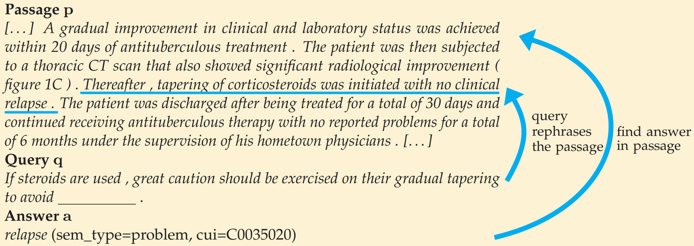

# Machine reading comprehension on clinical case reports


This is the accompanying code of:

 *[CliCR: A Dataset of Clinical Case Reports for Machine Reading Comprehension](https://arxiv.org/abs/1803.09720)*. Simon Šuster and Walter Daelemans. NAACL, 2018.




## Dataset availability

Thanks to an agreement with the publisher of BMJ Case Reports, we are allowed to freely distribute our dataset for research purposes. Please send us an email to *[simon.suster@unimelb.edu.au](mailto:simon.suster@unimelb.edu.au)*, and we will provide you with the link.

## Handling the dataset and baselines

Collect some statistics about the dataset:
```sh
python3 dataset-code/describe_data.py -train_file TRAIN_PATH -dev_file DEV_PATH -test_file TEST_PATH
```

Other:
* [baselines.py](dataset-code/baselines.py): run and evaluate baseline methods reported in the paper (apart from lang-model)
* [build_json_dataset.py](dataset-code/build_json_dataset.py): several functions for creating the dataset from BMJ Case Reports (code for scraping and processing HTML data from the web will be added later)
* [build_queries.py](dataset-code/build_queries.py): creating queries from learning points
* [embedding_eval.py](dataset-code/embedding_eval.py): embedding metrics for evaluation
* [evaluate.py](dataset-code/evaluate.py): evaluation code for EM, F1, BLEU-2, BLEU-4, embedding-average
* [evaluation_test.py](dataset-code/evaluation_test.py): unit test for the evaluation code
* [expand_answers.py](dataset-code/expand_answers.py): answer set extension using UMLS 
* [json_to_plain.py](dataset-code/json_to_plain.py): convert from CliCR json structure to plain format for applying SA and GA readers
* [randomized_hyperparameter_search.py](dataset-code/randomized_hyperparameter_search.py): finding optimal parameters for word embeddings and neural readers
* [refine_json_dataset.py](dataset-code/refine_json_dataset.py): removing instances matching partly with a part of the passage
* [run_emb_baseline.py](dataset-code/run_emb_baseline.py): find the best embedding hyper-parameters by running word2vec
* [util.py](dataset-code/util.py): various utilities

## Neural readers (adapted to CliCR)

To train the Stanford Attentive Reader:
```sh
THEANO_FLAGS=mode=FAST_RUN,device=gpu,floatX=float32 python main.py --train_file PATH/TO/train1.0.json --dev_file PATH/TO/dev1.0.json --embedding_file PATH/TO/embeddings  --log_file best.log --att_output False
```
This will use default parameters, with hidden size and dropout rate optimized on the development set. It also by default removes those instances from the dataset for which the answers are not found in their exact form in the corresponding passage. To change any of these parameters, modify `config.py`. The model will be saved as best.model.

Test the SA model:
```sh
THEANO_FLAGS=mode=FAST_RUN,device=gpu,floatX=float32 python main.py --test_only True --pre_trained best.model --train_file PATH/TO/train1.0.json --dev_file PATH/TO/test1.0.json --embedding_file PATH/TO/embeddings --log_file best.test.log
```

To run evaluation separately:
```sh
python3 dataset-code/evaluate.py -test_file PATH/TO/dev1.0.json -prediction_file predictions -embeddings_file PATH/TO/embeddings -downcase -extended
```
If you'd like to run an extended evaluation using BLEU and embedding-based metrics, use the option `-extended`. This embedding-based metrics will use the embeddings available in `-embeddings_file`.


To train the Gated Attention Reader with marked entities:
```sh
THEANO_FLAGS=mode=FAST_RUN,device=gpu,floatX=float32 python3 run.py --dataset clicr_plain --mode 1 --nhidden 67 --dropout 0.4 --use_feat 1 --data_path PATH/TO/dataset_plain/ent/gareader/ --experiments_path experiments/
```
Run `python3 run.py --help` to see the full list of options.

To test the GA reader model:

```sh
THEANO_FLAGS=mode=FAST_RUN,device=gpu,floatX=float32 python3 run.py --dataset clicr_plain --mode 2 --nhidden 67 --dropout 0.4 --use_feat 1 --data_path PATH/TO/dataset_plain/ent/gareader/ --experiments_path experiments/
```
